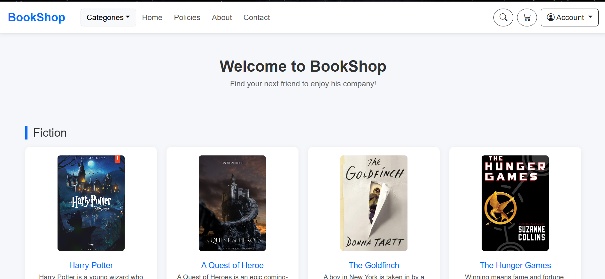
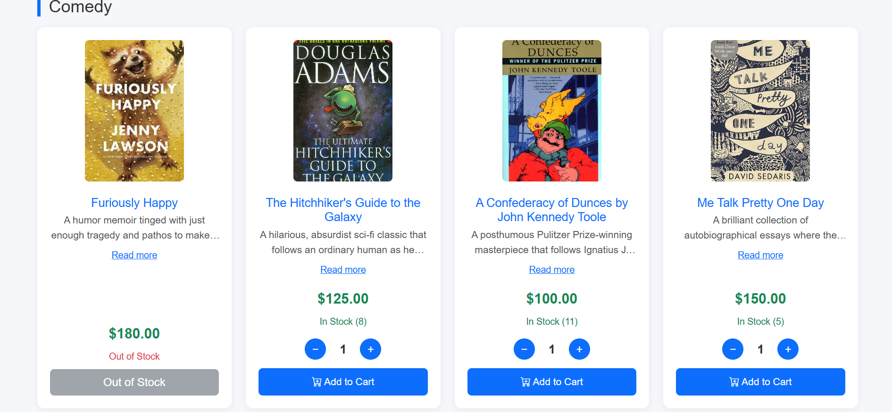

# BookShop - Online Bookstore Web Application

A fully functional online bookstore web application built with Flask. Users can browse books by category, search for books, add items to their shopping cart, and place orders. The application includes an admin dashboard for managing categories, books, inventory, and orders. BookShop is designed to be easy to use for both users and sellers.

---
## Home Page




---

## Features

- **User Authentication**: Register, login, and logout functionality with role-based access (admin/customer)
- **Book Browsing**: Browse books organized by categories with detailed descriptions
- **Search**: Search for books by title or description
- **Shopping Cart**: Add/remove books, update quantities with real-time stock validation
- **Order Placement**: Submit orders with shipping information (name, phone, address)
- **Admin Dashboard**:
  - Create, edit, and delete categories
  - Add, edit, and delete books with image upload
  - Manage inventory (stock levels)
- **Responsive Design**: Works on desktop, tablet, and mobile devices
- **Image Upload**: Upload book covers with automatic UUID renaming and validation
- **Client-side Validation**: Real-time form validation with JavaScript
- **Server-side Validation**: Comprehensive input validation with user-friendly flash messages

---

## Prerequisites

No additional modules are required beyond the Python standard library and Flask. However, you'll need to install Flask:

```bash
pip install flask
```

---

## Project Checklist

### ✅ It is available on GitHub.
**Repository**: (https://github.com/hagarmohamed25/BookShop-Website)

### ✅ It uses the Flask web framework.
**File**: `app.py` - Full Flask application with routes, sessions, and templates.

### ✅ It uses at least one module from the Python Standard Library other than the random module.

| Module | Usage | File |
|--------|-------|------|
| `datetime` | User registration timestamps | `app.py` line 72 |
| `uuid` | Unique image filenames | `app.py` lines 465, 537 |
| `re` | Email and phone validation | `app.py` lines 45, 170 |
| `json` | File I/O for data persistence | `models.py` |
| `os` | File path operations | `app.py`, `models.py` |

### ✅ It contains at least one class written by you that has both properties and methods. It uses `__init__()` to let the class initialize the object's attributes.

| Item | Details |
|------|---------|
| **File name for the class definition** | `models.py` |
| **Line number(s) for the class definition** | Lines 7 |
| **Name of two properties** | `USERS_FILE`, `BOOKS_FILE` |
| **Name of two methods** | `load_users()`, `save_users()`, `load_books()`, `save_books()` |

### ✅ It makes use of JavaScript in the front end and uses the localStorage of the web browser.
**File**: `static/js/script.js` - Complete localStorage implementation for user data persistence.

### ✅ It uses modern JavaScript (for example, let and const rather than var).
**Files**: All JavaScript files (`script.js`, `home.js`, `dashboard.js`) use `const` and `let` consistently.

### ✅ It makes use of the reading and writing to the same file feature.
**File**: `models.py` - The `Book_Shop` class handles reading from and writing to the same JSON files (`users.json` and `books.json`).

### ✅ It contains conditional statements.

| File | Line Number(s) | Description |
|------|---------------|-------------|
| `app.py` | 94 | User login authentication |
| `app.py` | 102 | Role-based redirects |
| `app.py` | 242 | Stock validation |
| `app.py` | 322 | Category name validation |
| `app.py` | 177, 179, 181 | Phone number validation |

### ✅ It contains loops.

| File | Line Numbers | Description |
|------|---------------|-------------|
| `app.py` | 93 | Loop through users for login authentication |
| `app.py` | 334 | Loop through categories to check for duplicates |
| `app.py` | 591, 592 | Loop through books for search functionality |

### ✅ It lets the user enter a value in a text box at some point. This value is received and processed by your back end Python code.
**Examples**:
- Registration form (username, email, password)
- Login form (email, password)
- Search form (search query)
- Order form (name, phone, address)
- Admin forms (category name, book title, description, price, stock)

### ✅ It doesn't generate any error message even if the user enters a wrong input.
All validation errors are handled with user-friendly flash messages or client-side validation indicators. No Python exceptions or error pages are shown to users.

### ✅ It is styled using your own CSS.
**Files**: `static/css/style.css`, `static/css/home.css`, `static/css/dashboard.css`

### ✅ The code follows the code and style conventions as introduced in the course, is fully documented using comments and doesn't contain unused or experimental code. In particular, the code should not use `print()` or `console.log()` for any information the app user should see. Instead, all user feedback needs to be visible in the browser.
- All code is thoroughly documented with comments
- User feedback is displayed via flash messages and browser alerts
- `console.log()` statements are only used for development debugging (not for user-facing information)

### ✅ All exercises have been completed as per the requirements and pushed to the respective GitHub repository.
All course exercises are completed and pushed to the GitHub repository.

---

## How to Run the Project

1. **Clone the repository**:
   ```bash
   git clone (https://github.com/hagarmohamed25/BookShop-Website)
   cd bookshop
   ```

2. **Install Flask**:
   ```bash
   pip install flask
   ```

3. **Run the application**:
   ```bash
   python app.py
   ```

4. **Open your browser** and navigate to:
   ```
   http://127.0.0.1:5000
   ```

---

## Default Admin Account

| Username | Email | Password | Role |
|----------|-------|----------|------|
| admin | admin@admin.com | 123456 | admin |

---

## Project Structure

```
bookshop/
├── database/
│   ├── books.json          # Book data storage
│   └── users.json          # User data storage
├── static/
│   ├── css/
│   │   ├── style.css       # Global styles
│   │   ├── home.css        # Home page styles
│   │   └── dashboard.css   # Dashboard styles
│   ├── js/
│   │   ├── script.js       # Global JavaScript
│   │   ├── home.js         # Home page JavaScript
│   │   └── dashboard.js    # Dashboard JavaScript
│   └── uploads/            # Book cover images
├── templates/
│   ├── home.html           # Home page
│   ├── dashboard.html      # Admin dashboard
│   ├── cart.html           # Shopping cart
│   ├── search.html         # Search results
│   ├── login.html          # Login page
│   └── register.html       # Registration page
├── app.py                  # Main Flask application
├── models.py               # Book_Shop class for data persistence
├── helpers.py              # Helper functions
└── README.md               # Project documentation
```

---

## Technologies Used

- **Backend**: Python, Flask
- **Frontend**: HTML5, CSS3, JavaScript
- **Data Storage**: JSON files
- **Styling**: Custom CSS with Bootstrap
- **Icons**: Bootstrap Icons, Font Awesome

---

## Features Not Seen Before

This project implements a **complete e-commerce bookstore** with:
1. **Role-based access control** (admin vs. customer)
2. **Full CRUD operations** for categories and books
3. **Shopping cart** with real-time stock validation
4. **Image upload** with automatic UUID renaming
5. **Egyptian phone number validation** (specific format: 010, 011, 012, 015 followed by 8 digits)
6. **Read more/less toggle** for book descriptions
7. **Quantity controls** with stock limits
8. **Client-side and server-side validation** with user-friendly feedback

---
